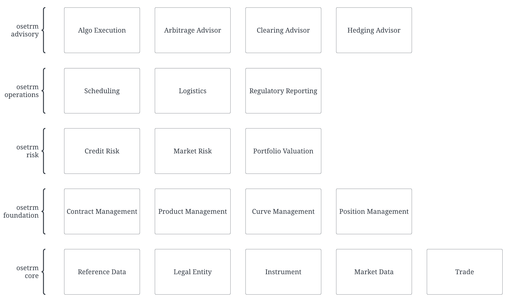

# Open Source Energy and Trading Risk Management 

The goal of the osetrm project is to create an energy trading risk management system which is modular, extensible, and open source. 

## Design Philosophy

Hyper iterative design - one thing as a time.  
Interfaces are the key - clean, concise, and domain driven.   
Clear separation of concerns.  
Value is aggregated. 

## Project Structure

### Interfaces
- osetrm-schema-proto-common
- osetrm-schema-proto-legal-entity
- osetrm-schema-proto-instrument
- osetrm-schema-proto-market-data
- osetrm-schema-proto-trade

### Subsystems
#### Reference Data
- (TBD)

#### Legal Entity
- osetrm-legal-entity-api
- osetrm-gleif-consumer (TBD)

#### Instrument
- (TBD)

#### Market Data
- (TBD)

#### Trade
- osetrm-trade-api (TBD)
- osetrm-trade-capture-cme (TBD)
- osetrm-trade-capture-ice (TBD)

